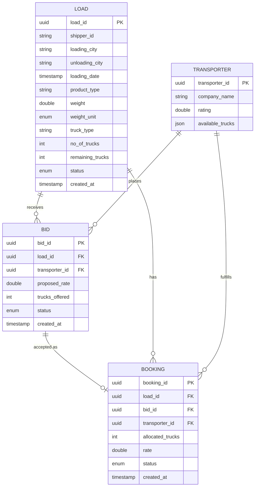
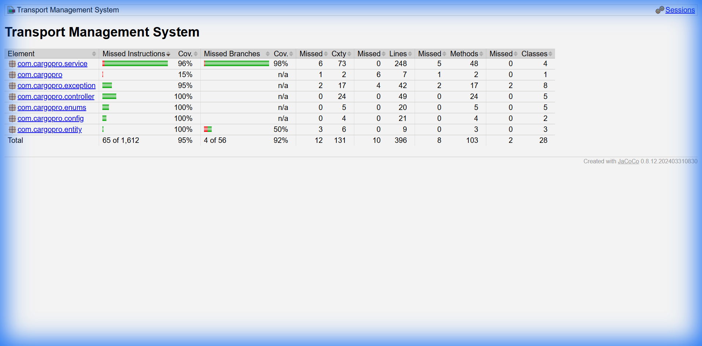

# Transport Management System

Backend system for managing loads, transporters, bids, and bookings in a logistics platform.

## Table of Contents
- [Database Schema](#database-schema)
- [API Documentation](#api-documentation)
- [Test Coverage](#test-coverage)
- [Tech Stack](#tech-stack)
- [Getting Started](#getting-started)
- [Deployment](#deployment)

---

## Database Schema



### Entity Relationships
| Relationship | Description |
|--------------|-------------|
| Load → Bid | One load can receive multiple bids |
| Transporter → Bid | One transporter can place multiple bids |
| Bid → Booking | An accepted bid becomes a booking |
| Load → Booking | One load can have multiple partial bookings |

---

## API Documentation

### Swagger UI
When running locally or deployed, access the interactive API documentation at:

```
http://localhost:8080/swagger-ui.html
```

**Live Deployment:** [Swagger UI on Hugging Face](https://samarth194-cargopro.hf.space)

### API Endpoints Overview

| Method | Endpoint | Description |
|--------|----------|-------------|
| **Loads** |||
| POST | `/load` | Create a new load |
| GET | `/load` | Get all loads (with filters) |
| GET | `/load/{id}` | Get load by ID |
| PATCH | `/load/{id}/cancel` | Cancel a load |
| GET | `/load/{id}/best-bids` | Get best bids for a load |
| **Transporters** |||
| POST | `/transporter` | Register a transporter |
| GET | `/transporter` | Get all transporters |
| GET | `/transporter/{id}` | Get transporter by ID |
| PUT | `/transporter/{id}/trucks` | Update truck availability |
| **Bids** |||
| POST | `/bid` | Place a bid |
| GET | `/bid` | Get all bids (with filters) |
| GET | `/bid/{id}` | Get bid by ID |
| PATCH | `/bid/{id}/reject` | Reject a bid |
| **Bookings** |||
| POST | `/booking` | Accept a bid (create booking) |
| GET | `/booking/{id}` | Get booking by ID |
| PATCH | `/booking/{id}/cancel` | Cancel a booking |
| GET | `/booking/load/{loadId}` | Get bookings by load |
| GET | `/booking/transporter/{id}` | Get bookings by transporter |

---

## Test Coverage

**139 Tests | 0 Failures | 0 Errors**



### Coverage Summary
| Package | Instructions | Branch |
|---------|-------------|--------|
| com.cargopro.controller | **100%** ✅ | N/A |
| com.cargopro.service | **91%** ✅ | 90%+ ✅ |
| com.cargopro.exception | **97%** ✅ | N/A |
| com.cargopro.config | 100% | N/A |
| com.cargopro.entity | 100% | 50% |

**Targets Achieved:**
- ✅ Service layer: 91% (target: 80%)
- ✅ Controller layer: 100% (target: 80%)
- ✅ Branch coverage: 90%+ (target: 70%)

Run tests: `mvn clean test`

---

## Tech Stack

| Component | Technology |
|-----------|------------|
| Language | Java 17 |
| Framework | Spring Boot 3.2.x |
| Database | PostgreSQL (Supabase) / H2 (testing) |
| ORM | Spring Data JPA / Hibernate |
| Docs | SpringDoc OpenAPI (Swagger) |
| Testing | JUnit 5, Mockito, MockMvc |
| Coverage | JaCoCo |
| Build | Maven |
| Deploy | Docker / Hugging Face Spaces |

---

## Getting Started

### Prerequisites
- Java 17+
- Maven 3.8+
- PostgreSQL (or use H2 for local dev)

### Run Locally
```bash
# Clone the repository
git clone https://github.com/your-repo/transport_management_system.git
cd transport_management_system

# Run with H2 (in-memory database)
mvn spring-boot:run

# Run tests
mvn clean test
```

### API will be available at
- Application: http://localhost:8080
- Swagger UI: http://localhost:8080/swagger-ui.html

---

## Deployment

This application is configured for deployment on Hugging Face Spaces using Docker.

### Environment Variables
Configure the following Secrets in your Hugging Face Space settings:

| Variable | Description |
|----------|-------------|
| `DB_HOST` | The hostname of your Supabase database |
| `DB_PORT` | The port (usually 5432 or 6543) |
| `DB_NAME` | The database name (e.g., postgres) |
| `DB_USERNAME` | Your Supabase database user |
| `DB_PASSWORD` | Your Supabase database password |

---

## License

This project is for educational/assignment purposes.
