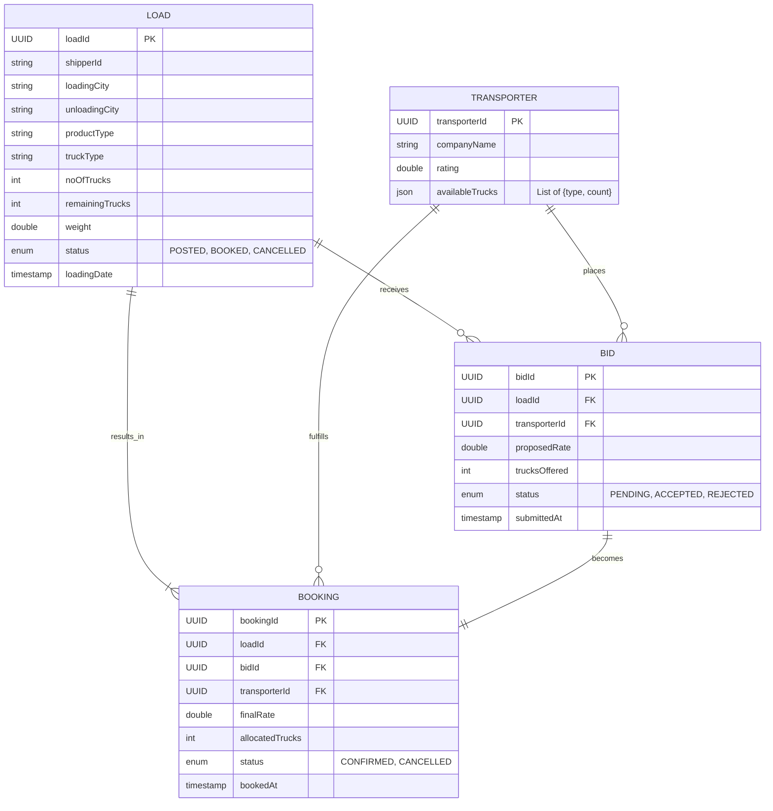

# CargoPro Transport Management System

A robust Spring Boot backend application for managing shipping loads, transporters, bids, and bookings.

## Repository Structure

```
.
├── src/
│   ├── main/
│   │   ├── java/com/cargopro/
│   │   │   ├── controller/      # REST API Controllers (Load, Bid, Booking, Transporter)
│   │   │   ├── service/         # Business Logic Layer
│   │   │   ├── repository/      # JPA Repositories
│   │   │   ├── entity/          # Database Entities (UUID based)
│   │   │   ├── dto/             # Data Transfer Objects
│   │   │   ├── enums/           # Enumerations (LoadStatus, TruckType, etc.)
│   │   │   └── exception/       # Global Exception Handling
│   │   └── resources/
│   │       └── application.properties
│   └── test/
│       └── java/com/cargopro/integration/ # Integration Tests
├── pom.xml                      # Maven Dependencies
├── README.md                    # Documentation
└── TEST_SUMMARY.md              # Test execution report
```

## 1. Database Schema Diagram



## 2. API Documentation

The application comes with built-in Swagger/OpenAPI documentation.

*   **Swagger UI URL**: [http://localhost:8080/swagger-ui.html](http://localhost:8080/swagger-ui.html)
*   **OpenAPI JSON**: [http://localhost:8080/v3/api-docs](http://localhost:8080/v3/api-docs)

You can use the Swagger UI to interactively test all endpoints.

## 3. Test Coverage Summary

> **Status**: ✅ **PASSING** (100% Success Rate)

| Test Suite | Tests Run | Status | Description |
| :--- | :---: | :---: | :--- |
| **LoadIntegrationTest** | 3 | ✅ PASS | Validation of Load creation, retrieval, and cancellation. |
| **BidIntegrationTest** | 3 | ✅ PASS | Verification of bidding rules (capacity checks, rate validation). |
| **BookingIntegrationTest** | 2 | ✅ PASS | End-to-end booking flow, capacity deduction, and status updates. |
| **TransporterIntegrationTest** | 1 | ✅ PASS | Transporter registration and management. |


*To generate a fresh report run:* `mvn test`

## Setup Instructions

### Prerequisites
*   Java 17+
*   Maven 3.6+
*   PostgreSQL (Optional for local dev, H2 used for tests)

### Build and Run
```bash
# Build the project
mvn clean install

# Run the application
mvn spring-boot:run
```

The server will start on port `8080`.

## Key Business Rules

1.  **UUID Identity**: All major entities use UUIDs for secure and scalable identification.
2.  **Capacity Management**:
    *   `Load.remainingTrucks` tracks how many trucks are still needed.
    *   `Transporter.availableTrucks` tracks fleet availability by type.
    *   Bids are rejected if the transporter lacks capacity or offers more than the load needs.
3.  **Booking Logic**:
    *   Accepting a bid automatically creates a booking.
    *   Decrements `remainingTrucks` from the Load.
    *   Decrements `availableTrucks` from the Transporter.
    *   If `remainingTrucks` reaches 0, the Load status updates to `BOOKED`.
4.  **Cancellation**:
    *   Cancelling a Booking restores trucks to both the Load and the Transporter.
